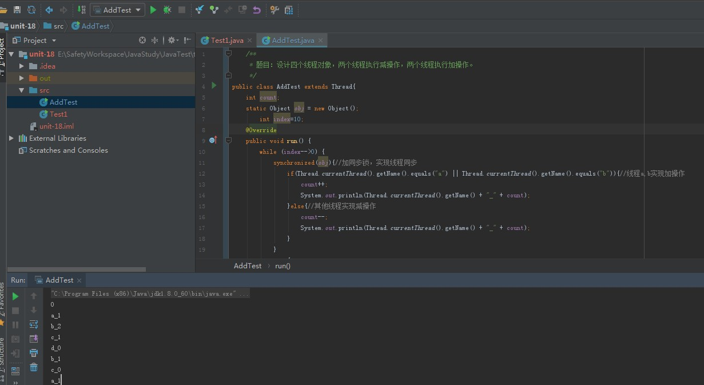

# 第十八章-多线程

## 本章知识点

- 什么是线程；实现线程的两种方式：继承Thread类；实现Runnable接口

- 线程的生命周期；

- 线程的操作方法：sleep();join();stop();yield()

- 线程优先级

- 线程同步：线程安全；线程同步机制

## 内容

### 线程介绍

- 线程是程序中一个单一的顺序控制流程；

- 一个线程则是进程中的执行流程，一个进程中可以同时包括多个线程，每个线程可以得到一小段程序的执行时间，这样一个进程就可以具有多个并发执行的程序

### 实现线程的两种方式

- 继承Thread类

> public class Thread extends Thread{  
> public void run(){  
>
> }
> }

- 实现Runnable接口

> public class Thread extends Objiect implements Runnable{ }  
> 调用start()方法启动线程

### 线程的生命周期

- 线程的生命周期有7种状态：出生状态；就绪状态；运行状态；等待状态；休眠状态；阻塞状态；死亡状态。

- 

- 线程休眠：

  - > try{  
    > Threa.sleep(200);  
    > }catch(InterruptuedException e){  
    > e.printStackTrace();  
    >  }

- 线程同步：通过使用synchronize关键字

   > synchronize(Object){ }  //同步块  
   > synchronize void f() //同步方法

## 学习目标

- 了解线程

- 掌握实现线程的两种方式

- 掌握线程的生命周期

- 掌握线程的操作方法

- 掌握线程的优先级

- 掌握线程同步机制

### 完成作业

- 

- 
