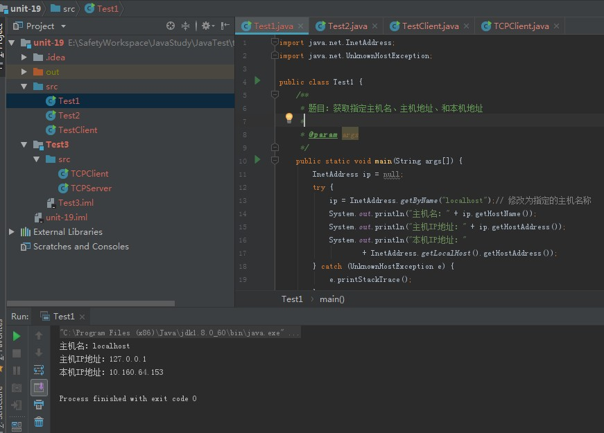
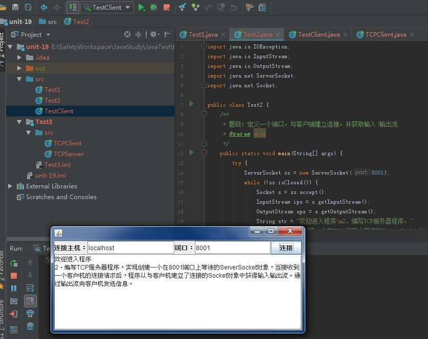
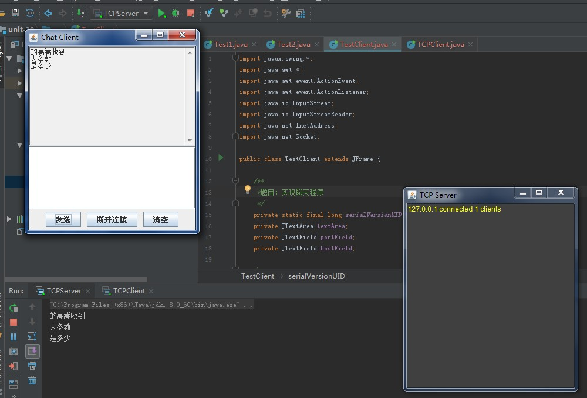

# 第十九章 网络通信

## 本章知识点

- 网络通信协议(TCP/IP)，端口和套接字
- TCP程序设计基础：IntAddress类、ServerSocket类、TCP网络程序
- UDP程序设计基础：DatagramPacket类、DatagramSocket类、UDP网络程序

## 内容

### 网络协议

- 网络协议为计算机网络中进行数据交换而建立的规则、标准或约定的集合。

- 网络协议是网络上所有设备（网络服务器、计算机、交换机、路由器、防火墙等）之间通信规则的集合，它规定了通信时信息必须采用的格式和这些格式的意义。

- 计算机网络体系结构的通信协议划分为七层，自下而上依次为：物理层（Physics Layer）、数据链路层（Data Link Layer）、网络层（Network Layer）、传输层（Transport Layer）、会话层（Session Layer）、表示层（Presentation Layer）、应用层（Application Layer）。

### TCP与UDP协议

- TCP协议：传输控制协议，提供的是面向连接、可靠的字节流服务。当客户和服务器彼此交换数据前，必须先在双方之间建立一个TCP连接，之后才能传输数据。TCP提供超时重发，丢弃重复数据，检验数据，流量控制等功能，保证数据能从一端传到另一端。

- UDP协议：用户数据报协议，是一个无连接的简单的面向数据报的传输层协议。UDP不提供可靠性，它只是把应用程序传给IP层的数据报发送出去，但是并不能保证它们能到达目的地。由于UDP在传输数据报前不用在客户和服务器之间建立一个连接，且没有超时重发等机制，故而传输速度很快。

#### TCP协议和UDP协议之间的区别

- TCP发送的包有序号，对方收到包后要给一个反馈，如果超过一定时间还没收到反馈就自动执行超时重发，因此TCP最大的优点是可靠。一般网页（http）、邮件（SMTP)、远程连接(Telnet)、文件(FTP)传送就用TCP。
- UDP是面向消息的协议，通信时不需要建立连接，数据的传输自然是不可靠的，UDP一般用于多点通信和实时的数据业务，比如语音广播、视频、QQ、TFTP(简单文件传送）、SNMP（简单网络管理协议）、RTP（实时传送协议）RIP（路由信息协议，如报告股票市场，航空信息）、DNS(域名解释）。注重速度流畅。

#### Socket

- 套接字（socket）是通信的基石，是支持TCP/IP协议的网络通信的基本操作单元。它是网络通信过程中端点的抽象表示，包含进行网络通信必须的五种信息：连接使用的协议，本地主机的IP地址，本地进程的协议端口，远地主机的IP地址，远地进程的协议端口

### TCP程序设计基础

- IntAddress:

  - 是与IP地址相关联的类，介意获取IP地址，主机地址等信息；
  - 常用方法：getByName(String host);getHostAddress();getHostName();getLocalHost();

- ServerSocket类：

  - 用于表示服务器套接字，主要功能是等待来自网络上的“请求”；
  - SeverSocket类构造方法都抛出IOException异常；
  - 常用方法：accept();isBound();getInetAddress();isClosed();close();bind();getInetAddress();

### UDP程序设计基础

- DatagramPacket()类：用来表示数据包。

- DatagramSocket()类：用来表示发送和接收数据包的套接字。

## 学习目的

- 了解网络程序设计基础
- 学会编写TCP程序
- 学会编写UDP程序

### 课后练习

